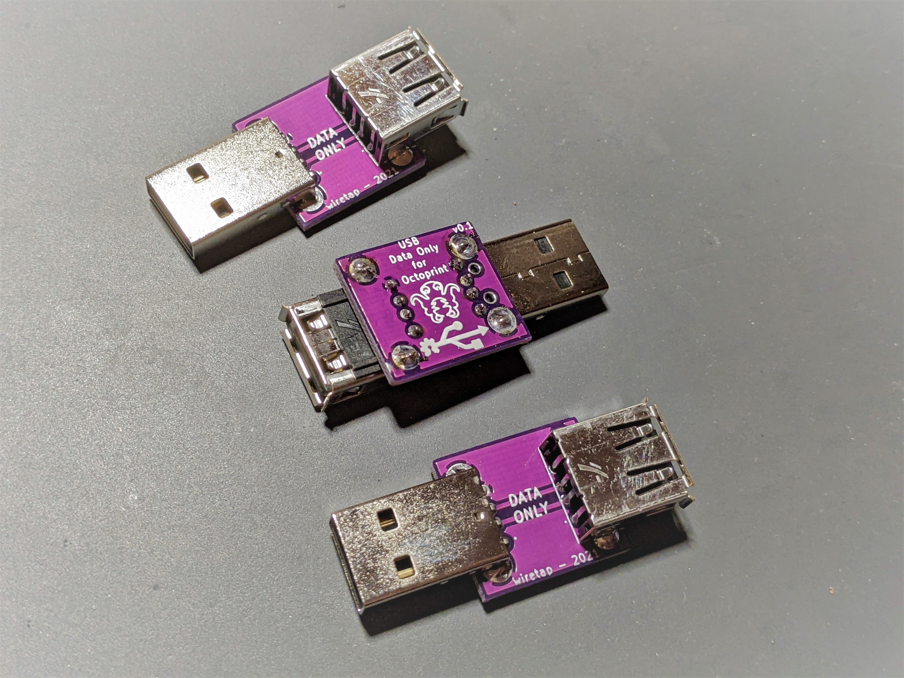

# USB Data Only
A simple USB adapter for 3D printers to only allow data (not power) through the USB interface.

## Info
This adapter is useful for a 3D printer so your Raspberry Pi (or other small computer) doesn't try to power your 3D printer when you shut it off. Many 3D printer control boards will continue to recieve power from a USB device after powered off, resulting in drawing too much power through the Raspberry Pi which can cause damage to it. Plug this adapter inline with your USB cable to only allow data to pass, but not 5V power.
\
\
I have been using this adapter on my Longer LK5 Pro in conjunction with a Raspberry Pi 4 for roughly a year now, and I have no issues with it. 
